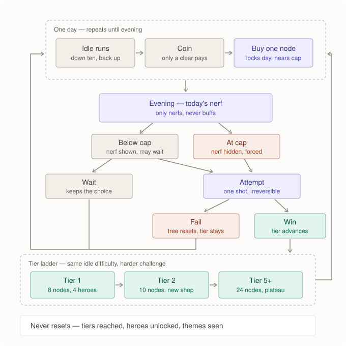
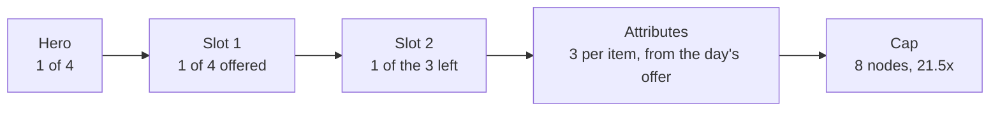

# Game loop

**The player picks a hero, a bot plays it, and one challenge per day decides
whether the run of days advances.**

**Every number here is an INITIAL GUESS.** Nothing in this document is
implemented, and no number moves to `docs/balance.md` until it is.

Derives from `docs/project/objectives.md`. The shape of a single run lives in
`docs/map-design.md`. What the hero carries lives in `docs/project/items.md`.
Neither is repeated here.

---

## Four timescales

The whole design is these not mixing.

| scale | length | what changes | what survives it |
|---|---|---|---|
| **run** | minutes | nothing | the coin it paid |
| **day** | hours | the tree grows and locks | everything, until the challenge |
| **challenge** | one per day of presence | resolves the day | the tier |
| **tier** | ~5–8 days | theme, shop, depth, cap | heroes and themes, forever |

---

## The loop

---

## Inside one day

| moment | what happens | what it locks |
|---|---|---|
| morning | the day's nerf is announced | — |
| all day | idle runs earn coin | — |
| any time | buy a node | **the first purchase locks the hero for the day** |
| evening | attempt, or wait | attempting is irreversible |

| rule | |
|---|---|
| only a completed run pays coin | a death pays nothing |
| node budget | 2–3 per day, **does not carry over** |
| coin | carries over |
| buying a node | moves the hero toward the cap — see below |

**Buying is not free.** Each node nears the cap, and the cap costs the right to
choose the day. "Buy another, or attempt today?" is the day's real decision.

---

## How the day's runs reach the challenge — owner philosophy, nothing built

The runs are the SHORT cycle and the challenge is the MEDIUM one
(`objectives.md`, "the reward cycles"), and the link between them is the
RESULTS, not only the coin: **the day's challenge is influenced by the sum
or average of every run that day, loss or win** — a win contributing more.

The model is a Formula 1 driver: countless small, fast decisions chasing a
marginal improvement per lap, where getting ahead requires many laps without
errors or with only small ones — and where one large error, or a short chain
of small ones, costs almost everything. **Large errors weigh
disproportionately, closer to exponential than linear.**

Three consequences for this loop, none designed yet:

- **Every run pays something toward the day.** A lost run is a lost round,
  not a void — it still feeds the rounds after it, inside the same day.
- **What a run pays dies at the boundary.** The day (or the contest that
  bounds it) settles; only the challenge's own outcome pays what crosses —
  the tier. This is `objectives.md`'s "what a loss owes" applied here, and
  it is also **the brake the snowball is missing**: today the shop pile
  carries run to run with no boundary that ever settles it, which is exactly
  the compounding `decisions.md` measured. A bounded contest gives the pile
  a place to die that is not only the death reset.
- **The AFK game must move slower than the played one.** Absence drives only
  the short cycle, and the pre-AFK choice is the heaviest decision in the
  game — it has to be possible to choose it WELL, against conditions that
  vary, or it is a preference.

---

## The challenge

| state | attempt | is the nerf visible? |
|---|---|---|
| below cap | optional | **yes**, announced in the morning |
| at cap | **forced** | **no** |

The cap takes both the choice of day and the information about it. That is what
stops "wait for the cap, then wait for a good day" from being the only strategy.

| outcome | tree | coin | tier |
|---|---|---|---|
| wait | keeps | keeps | keeps |
| fail | **resets** | resets | keeps |
| win | carries to the next tier | keeps | **+1** |

### The nerf

| rule | |
|---|---|
| direction | **only nerfs, never buffs** — the best possible day is neutral |
| size | the swing must be **at least as large as the whole power ramp** |
| repeat | never the same one twice |
| testable in idle? | **no** — the challenge configuration is not playable during the day |

**This is the load-bearing piece and nothing about it is designed yet.** If the
swing is small, building dominates reading and the loop is a straight line with
a die at the end.

---

## The tier ladder

`nodes = slots + (slots × attributes per item)`

| tier | slots | attrs/item | nodes | shop offers | idle difficulty | challenge |
|---|---|---|---|---|---|---|
| 1 | 2 | 3 | **8** | 4 items | baseline | baseline |
| 2 | 2 | 4 | **10** | 4 items | baseline | + |
| 3 | 3 | 4 | **15** | 4 items | baseline | ++ |
| 4 | 3 | 5 | **18** | 4 items | baseline | +++ |
| 5–10 | 4 | 5 | **24** | 4 items | baseline | ++++ … |

Two rules that make the ladder work:

| rule | why |
|---|---|
| **idle difficulty is the same at every tier** | a reset hero must always be able to farm — otherwise a high-tier reset is a death spiral |
| **depth grows to tier 5, then plateaus** | past that, losing the tree stops being tense and becomes unbearable |
| **tiers get longer by depth, never by price** | price inflation adds waiting, not decisions |

Beyond tier 5 only the challenge rises. Eventually it is not passable — that is
the intended end of the ladder, not a bug.

---

## The tree

| property | |
|---|---|
| slots | **granted by the tier, never bought** — a bought slot is a no-brainer |
| every node | equal power in expectation, **unequal against any given nerf** |
| every attribute | a trade-off, never a bonus |
| price curve | derived from how coin income scales, so **time per node stays constant** |
| what fills the nodes | **drawn, not fixed** — see `docs/project/items.md` |

---

## Heroes

| | count | unlocked by | trait |
|---|---|---|---|
| **base** | 4 | available from the start | one each — see below |
| **unlocked** | 4–6 over the whole game | **achievements, never coin** | one rule-breaking mechanic each |

Heroes are **not a per-tier axis.** Eight to ten for the entire game.

### The base four — owner-defined, spec'd in `candidates.md` U7

Not invented here. `U7` is the build spec and was already checked against the
code; this section only places it in the loop.

|  | breadth | depth |
|---|---|---|
| **combat** | **Pawa** — armour | **Vito** — damage |
| **information** | **Papazito** — wide, shallow | **Ricardo** — narrow, deep |

| hero | trait | what you see in thirty seconds |
|---|---|---|
| **Pawa** | a shield is worth more to him, and **he can buy armour at every floor transition**, not only between runs | stops to shop mid-descent, tanks fights nobody else survives |
| **Vito** | an axe is worth more to him, and his fight margins are **deliberately looser than optimal** | takes fights the others refuse, and wins them faster |
| **Papazito** | sees **position and type across the whole map**, always — but not what anything holds | never backtracks, plans the room order from the first turn |
| **Ricardo** | normal fog, but knows the **true loot value** of anything already in view | never opens an empty chest, never detours toward a creature carrying nothing |

**The two information heroes are an explicit trade, not a ladder.** Papazito
sees far and shallow; Ricardo sees near and deep. Neither sits at "sees
everything" on both axes.

**Pawa's trait no longer fits the loop.** Buying mid-run assumed coin that is
spendable during a descent, which the node shop removed. `U7`'s Pawa section is
stale and the replacement is an owner decision, not a doc one.

### Three things this roster implies for the loop

**1. The base four are not free to build.** Only Vito is close to a dial
preset. Pawa needs a mid-run purchase trigger and is blocked on the coin
economy as well as the picker; Papazito and Ricardo need `observe()` taking a
persona-scoped visibility parameter. And the picker itself makes persona a
second run-state axis alongside the seed, which every test and every frozen
probe has to carry.

**2. Papazito and Ricardo are descent specialists, and the return switches
their traits off.** On the way up the map is already known and there are no
chests, so map-wide vision and loot truth are worth close to nothing. That is
consistent rather than broken — their bet is *get rich and well-routed going
down, then survive the climb on that* — but it should be stated, because it
makes them the sharpest expression of the two-economy split.

**3. The shop must not sell what a persona already is.** A vision item is a
weaker Papazito; a loot-truth item is a weaker Ricardo. Same failure `U7`
already names between Vito and Ricardo. The rule and the current draft of the
offer are in `docs/project/items.md`.

### Rules for every hero

| rule | test |
|---|---|
| visible in play | **cannot tell which hero is running in thirty seconds → not a trait** |
| wrong sometimes | a real weakness, and one that shows on screen |
| an unlock buys **a different way to lose**, not a lower chance of losing | **an unlocked hero with a higher win rate than both base heroes → the antagonism failed** |
| a hero trait changes **how** the bot pursues its objectives, never **what** they are | needing a third objective means it is a game rule wearing a hero's name |

---

## What the hero carries

**Its own document: `docs/project/items.md`.** It fills the skeleton this one
defines — where items come from, what each does, the three attribute
categories, the generator that draws them, and what the shop fixes versus
draws.

**Stamina lives there too.** It is a hero resource rather than an item, but it
is the currency half the attributes are paid in and the reason one of the items
is possible at all, so it sits with them until it is built and moves to
`docs/rules.md`.

---

## Tier 1, concretely

**2 slots. 4 items on offer. 3 attribute categories. 8 nodes to the cap.**

### The purchase menu, node by node

| node | you choose from | options | cost |
|---|---|---|---|
| 1 | an item for slot 1 | 4 offered | **1×** |
| 2 | an item for slot 2 | the 3 remaining | **1.5×** |
| 3–8 | an attribute, for either item | what the day offers, minus what the item has | **by the item's attribute count** |

| attribute on an item that has… | cost |
|---|---|
| none yet | **2×** |
| one already | **3×** |
| two already | **4.5×** |

Cost is set by **the item's own depth, not the node number** — so spreading
across both items is cheaper than specialising one. Broad or deep is a real
trade, priced.

**Whole tier-1 tree: 21.5×.** At roughly 5–7× of income per day, that is three
to four days to the cap.

### Content cost per tier

| axis | cadence | cost |
|---|---|---|
| dungeon / theme | every tier | procedural — near free |
| tree depth | every tier to 5 | arithmetic — free |
| shop offer | drawn from a fixed vocabulary | cheap |
| attributes | fixed vocabulary | paid once |
| **hero** | **rare, by achievement** | **manual, expensive** |

Ten tiers cost one parameterised generator, ~14 item bases, ~6 attributes, and
no mandatory new hero. That is fundable by one person.

---

## Economy

| | accrues while away | resets on a failed challenge | gated by |
|---|---|---|---|
| coin | **yes** | yes | — |
| node budget | **no** | — | one day |
| the tree | — | **yes** | the node budget |
| tier | no | **no** | the challenge |
| heroes, themes | no | **no** | achievements |

> **Absence buys money. It never buys days.**

| question | answer |
|---|---|
| away three days, then return? | rich, not ahead — the surplus buys **deeper** nodes, not more of them |
| does the challenge fire while away? | **no.** It fires at the end of the next day played |
| wallet cap? | **not built.** The per-day node gate already makes surplus inert. If a returning player is seen skipping days of progression, add one — derived from the price of the next node, never a free-standing number |

---

## Two modes

| | budget | scores | serves |
|---|---|---|---|
| **idle / free** | unlimited | no | accumulation, learning the heroes, novelty |
| **daily challenge** | one, small, fixed | yes | precious, comparable, the skill |

Progression never enters the challenge as an advantage; the challenge is where
what you learned is spent.

---

## Open

Ordered by risk. Item and shop questions live in `docs/project/items.md`.

| # | question | why it matters |
|---|---|---|
| 1 | **the nerf catalogue** — nothing designed | without a large swing the whole loop is a straight line |
| 2 | **Pawa's replacement trait** | the spec'd one assumed a shop the loop no longer has |
| 3 | do the four personas read as four on screen | `U7`'s own validation gate: distinct behavioural signatures by batch, before it counts as done |
| 4 | does coin reset on failure | affects whether a bad streak is recoverable |
| 5 | switching hero at tier-up — cost and compensation | keeping the build is strictly better, so a plain choice would be fake |
| 6 | recovery rule, in code | a zero hero must win idle runs at **every** tier |
| 7 | the session report | the moment the player actually consumes the game, and it does not exist |
